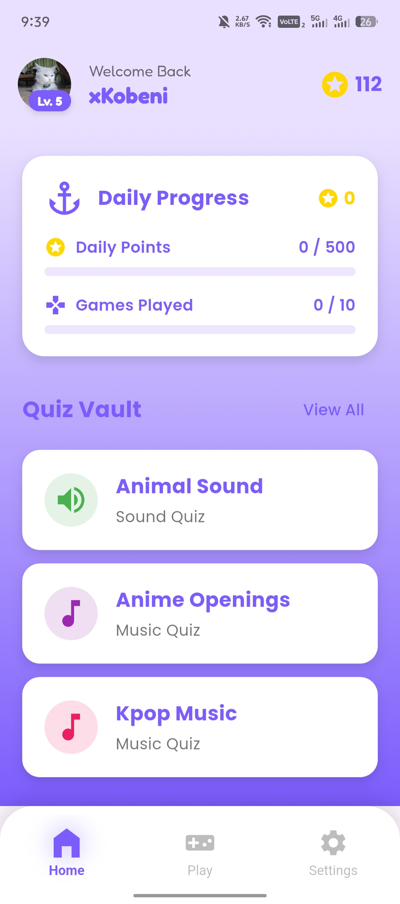
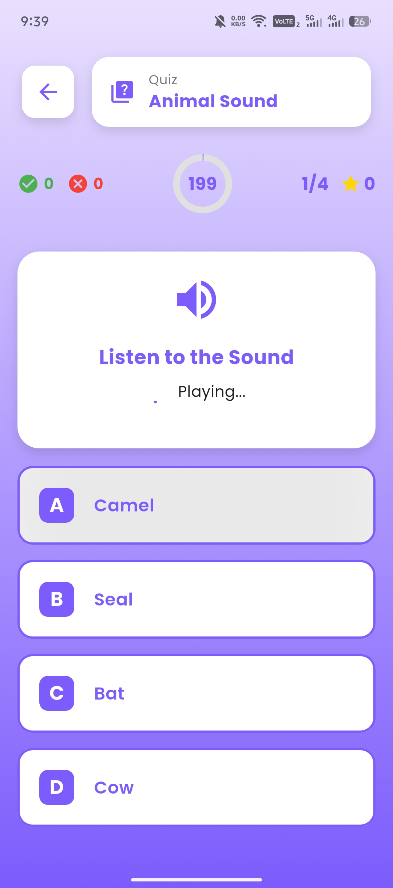
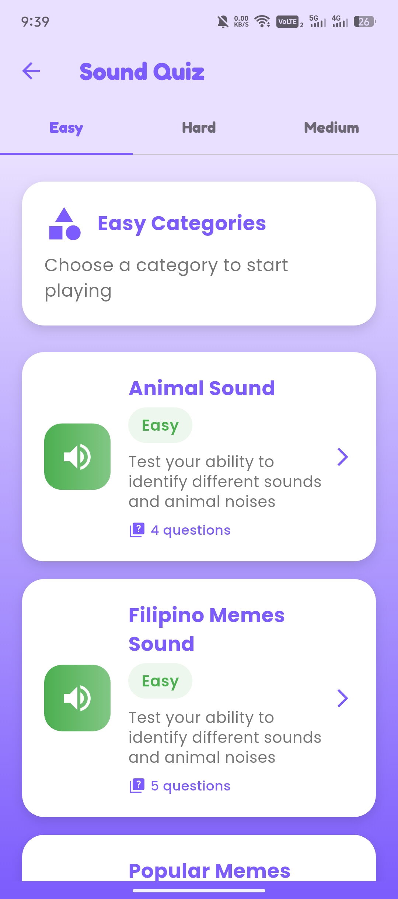
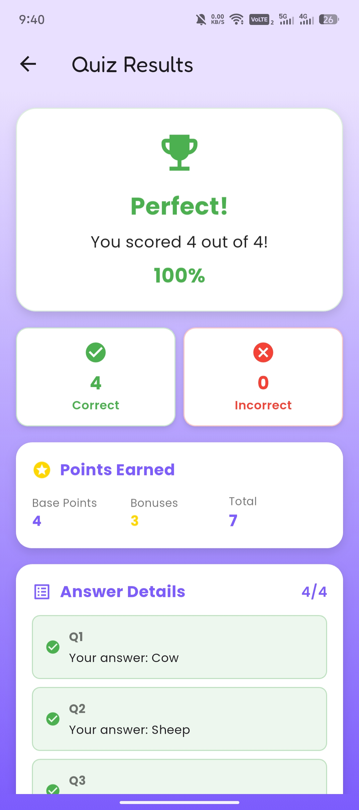
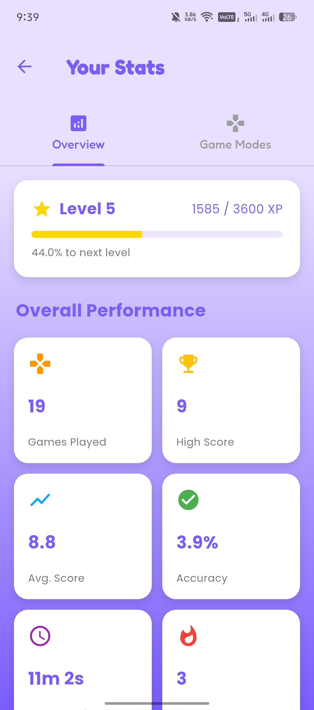
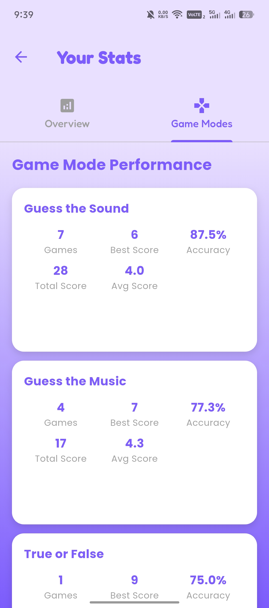
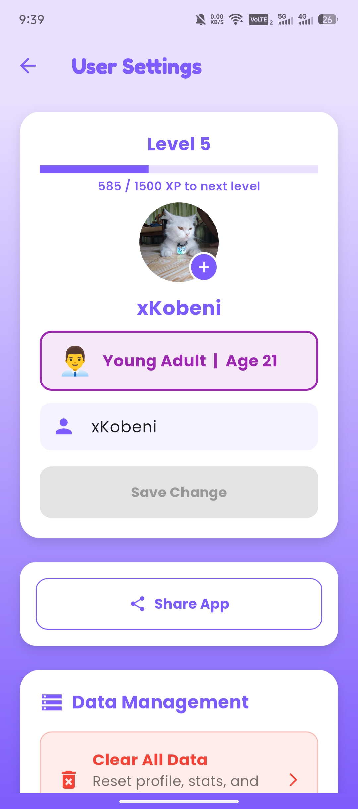
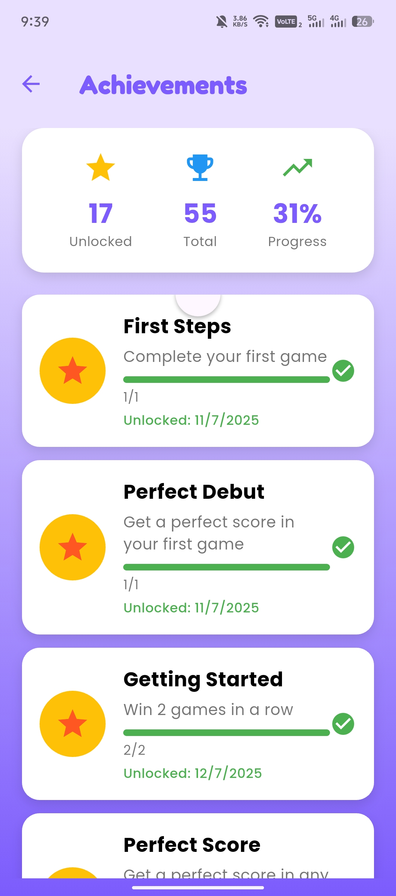
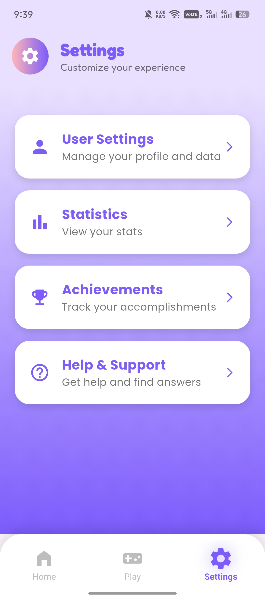

# SoundSprint · Hear It. Guess It. Win It!

A comprehensive Flutter-based educational game application that focuses on audio recognition, music appreciation, and interactive learning. Test your auditory skills by identifying sounds, music clips, and answering various types of questions in this engaging, privacy-friendly mobile game.

## 🎯 Features

### Core Gameplay
- **5 Game Modes**: Audio recognition, music identification, true/false questions, vocabulary challenges, and image-based games
- **Progressive Difficulty**: Adaptive difficulty system with Easy, Medium, and Hard levels
- **Real-time Feedback**: Immediate feedback on answers with visual and audio cues
- **Timer System**: Configurable time limits based on difficulty level
- **Progress Tracking**: Comprehensive tracking of user performance metrics

### User Experience
- **Onboarding Flow**: Guided first-time user experience with age categorization
- **Personalized Content**: Age-appropriate content and difficulty scaling
- **Tutorial System**: Interactive tutorials for new features and game modes
- **Accessibility Support**: Screen reader support, high contrast modes, and audio descriptions
- **Offline Capability**: Core functionality works without internet connection

### Social & Engagement
- **Achievement System**: 50+ achievements across multiple categories
- **Daily Challenges**: Daily points system with rewards
- **Statistics Dashboard**: Detailed performance analytics
- **Progress Visualization**: Visual progress indicators and charts
- **Notification System**: In-app notifications for achievements and daily rewards

## 🕹️ Game Modes

### 1. Guess The Sound (`GuessTheSound`)
- **Description**: Audio recognition game for various sound categories
- **Categories**: Animal sounds, nature sounds, Filipino memes, popular memes
- **Mechanics**: Play audio clip, select correct answer from multiple choices
- **Difficulty Levels**: Easy (20s), Medium (12s), Hard (9s)

### 2. Guess The Music (`GuessTheMusic`)
- **Description**: Music identification game
- **Categories**: K-pop, Anime openings, OPM (Original Pilipino Music)
- **Mechanics**: Play music clip, identify song title or artist
- **Features**: Support for audio clips with start/end timestamps

### 3. True or False (`TrueOrFalse`)
- **Description**: Fact-based true/false questions
- **Topics**: General knowledge, music facts, cultural information
- **Mechanics**: Read question, select true or false
- **Scoring**: Binary scoring system

### 4. Vocabulary (`Vocabulary`)
- **Description**: Language learning and vocabulary building
- **Content**: Word definitions, translations, context usage
- **Mechanics**: Multiple choice questions about word meanings
- **Educational Focus**: Language development and comprehension

### 5. Guess The Image (`GuessTheImage`)
- **Description**: Visual recognition game
- **Content**: Historical figures, cultural icons, landmarks
- **Mechanics**: View image, select correct identification
- **Categories**: Philippine heroes, international figures, cultural symbols

## 📱 Screenshots

### Main Interface

*Main dashboard with game mode selection and user statistics*

### Gameplay

*Active gameplay with question display and answer options*


*Category selection page for different game modes*

### Results & Analytics

*Game completion summary with score breakdown*


*Detailed statistics and performance analytics*


*Additional statistics and progress tracking*

### User Features

*User profile management and personal statistics*


*Achievement system with unlock progress*


*App settings and preferences configuration*

## 📥 Download

### Android
- **APK Download**: [SoundSprint Android APK](https://drive.google.com/drive/folders/1_90IGyHbsk_StIHReOoMr6wIahztlBVe)


## 🚀 Getting Started

### Prerequisites

- Flutter SDK (3.22 or higher)
- Dart SDK (3.8.1 or higher)
- Android Studio / VS Code
- Android device/emulator or iOS device/simulator

### Installation

1. **Clone the repository**
   ```bash
   git clone https://github.com/yourusername/flutter_application_practice.git
   cd flutter_application_practice
   ```

2. **Install dependencies**
   ```bash
   flutter pub get
   ```

3. **Add your audio content**
   - Place sound effects in `assets/sounds/` (3-5 second clips)
   - Place music clips in `assets/music/` (10-30 second excerpts)
   - Update `assets/data/questions.json` with your question data

4. **Run the app**
   ```bash
   flutter run
   ```

## 📁 Project Structure

```
lib/
├── main.dart                    # App entry point and configuration
├── models/                      # Data models
│   ├── achievement.dart         # Achievement data structure
│   ├── sound_question.dart      # Question data structure
│   └── user.dart               # User profile data
├── pages/                       # UI screens
│   ├── splash_page.dart         # Loading screen
│   ├── onboarding_page.dart     # First-time user setup
│   ├── main_navigation_page.dart # Tab navigation
│   ├── home_page.dart           # Main dashboard
│   ├── game_selection_page.dart # Game mode selection
│   ├── category_selection_page.dart # Category selection
│   ├── game_page.dart           # Main gameplay screen
│   ├── result_page.dart         # Game results display
│   ├── stats_page.dart          # User statistics
│   ├── profile_page.dart        # User profile
│   ├── settings_page.dart       # App settings
│   └── achievements_page.dart   # Achievement display
├── utils/                       # Business logic and utilities
│   ├── managers/                # State management and services
│   ├── game_logic/              # Game mode implementations
│   ├── tests/                   # Unit and integration tests
│   └── question_loader.dart     # Data loading utilities
└── widgets/                     # Reusable UI components
    ├── answer_option_button.dart
    ├── bottom_nav_bar.dart
    ├── question_card.dart
    ├── sound_preview_widget.dart
    ├── tutorial_overlay.dart
    └── permission_utils.dart

assets/
├── sounds/                      # Sound effect files (.mp3, .wav)
│   ├── animals/                 # Animal sound effects
│   ├── nature/                  # Nature sound effects
│   ├── popular_memes/           # Popular internet memes
│   └── ph_meme/                 # Filipino meme sounds
├── music/                       # Music clip files (.mp3)
│   ├── kpop/                    # K-pop music tracks
│   ├── anime/                   # Anime opening themes
│   └── opm/                     # Original Pilipino Music
├── images/                      # Image assets
│   ├── heroes/                  # Historical figures and heroes
│   └── emp/                     # Additional image content
├── fonts/                       # Font assets
│   ├── Fredoka/                 # Variable font for headings
│   └── Poppins/                 # Font family for body text
└── data/
    └── questions.json           # Comprehensive question database
```

## 📊 Question Format

Questions are defined in `assets/data/questions.json`:

```json
{
  "GuessTheSound": {
    "Animal Sound": {
      "Easy": [
        {
          "mode": "GuessTheSound",
          "category": "Animal Sound",
          "difficulty": "Easy",
          "type": "sound",
          "file": "dog_bark.wav",
          "options": ["Dog", "Cat", "Cow", "Horse"],
          "correctAnswer": "Dog"
        }
      ]
    }
  },
  "GuessTheMusic": {
    "Kpop Music": {
      "Medium": [
        {
          "mode": "GuessTheMusic",
          "category": "Kpop Music",
          "difficulty": "Medium",
          "type": "music",
          "file": "bts_dynamite.mp3",
          "clipStart": 10,
          "clipEnd": 25,
          "options": ["BTS Dynamite", "Blackpink DDU-DU", "Twice Fancy", "Red Velvet Psycho"],
          "correctAnswer": "BTS Dynamite"
        }
      ]
    }
  }
}
```

## 🏆 Achievement System

### Achievement Categories
- **Score-Based**: Perfect Score, High Scorer, Excellent Player, Master Player
- **Streak-Based**: Getting Started, Getting Hot, On Fire, Unstoppable, Legendary
- **Game Count**: Dedicated Player, Regular Player, Veteran Player, Century Club, Addicted
- **Accuracy**: Good Listener, Sharp Ears, Perfect Pitch
- **Category-Specific**: Animal Whisperer, Nature Explorer, Meme Master, Music Lover, Vocabulary Expert
- **Difficulty-Based**: Easy Rider, Medium Master, Hard Core, Difficulty Explorer

## 🛠️ Dependencies

- **audioplayers**: Low-latency audio playback
- **shared_preferences**: Local data storage
- **provider**: State management
- **image_picker**: Profile avatar selection
- **connectivity_plus**: Network status monitoring
- **animated_text_kit**: Text animations
- **path_provider**: File system access
- **overlay_support**: Notification overlays

## 📈 Analytics

The app tracks various metrics locally:
- Total games played and scores
- Average accuracy per category and game mode
- Most-missed questions and replay counts
- Personal bests and streaks
- Total playtime and daily engagement
- Achievement progress and unlock rates
- Difficulty progression and skill assessment

## 🔐 Privacy & Offline

- **100% Offline**: No internet connection required
- **Local Storage**: All data stays on your device
- **No Tracking**: No analytics sent to external services
- **Privacy-First**: Your gameplay data belongs to you
- **No Ads**: Clean, ad-free experience

## 🎵 Audio Requirements

- **Sound Effects**: 3-5 second MP3/WAV files
- **Music Clips**: 10-30 second MP3 excerpts
- **Royalty-Free**: Ensure you have rights to use all audio content
- **File Size**: Keep files reasonably sized for app performance
- **Quality**: High-quality audio for better user experience

## 🚀 Future Enhancements

- **Multiplayer Mode**: Competitive and cooperative gameplay
- **Cloud Synchronization**: Backup stats and progress
- **AI-Generated Content**: Dynamic question generation
- **Social Features**: Leaderboards and friend challenges
- **Advanced Analytics**: Detailed performance insights
- **Content Creation Tools**: User-generated questions and categories
- **Voice Recognition**: Speech-based answer input
- **AR Integration**: Augmented reality game modes

## 🤝 Contributing

1. Fork the repository
2. Create a feature branch (`git checkout -b feature/amazing-feature`)
3. Commit your changes (`git commit -m 'Add amazing feature'`)
4. Push to the branch (`git push origin feature/amazing-feature`)
5. Open a Pull Request

### Development Guidelines
- Follow Flutter best practices and conventions
- Add tests for new features
- Update documentation for API changes
- Ensure accessibility compliance
- Test on multiple platforms

## 📄 License

This project is licensed under the MIT License - see the [LICENSE](LICENSE) file for details.

## 👨‍💻 Development

Built with Flutter 3.22 and tested on:
- **Android**: 12+ (API level 31+)
- **iOS**: 17+
- **Windows**: 10/11
- **macOS**: 12+
- **Linux**: Ubuntu 20.04+
- **Web**: Chrome, Firefox, Safari, Edge

## 📞 Support

If you encounter any issues or have questions:
- **GitHub Issues**: [Open an issue](https://github.com/yourusername/flutter_application_practice/issues)
- **Documentation**: [SoundSprint Documentation](SoundSprint_Documentation.md)
- **Flutter Docs**: [Flutter documentation](https://docs.flutter.dev/)
- **Community**: Join our Discord server (coming soon)

## 🙏 Acknowledgments

- **Flutter Team**: For the amazing framework
- **Audio Contributors**: For providing high-quality audio content
- **Open Source Community**: For the libraries and tools used
- **Beta Testers**: For valuable feedback and bug reports

---

**Happy Gaming! 🎮🎵**

*SoundSprint - Where Learning Meets Entertainment*
